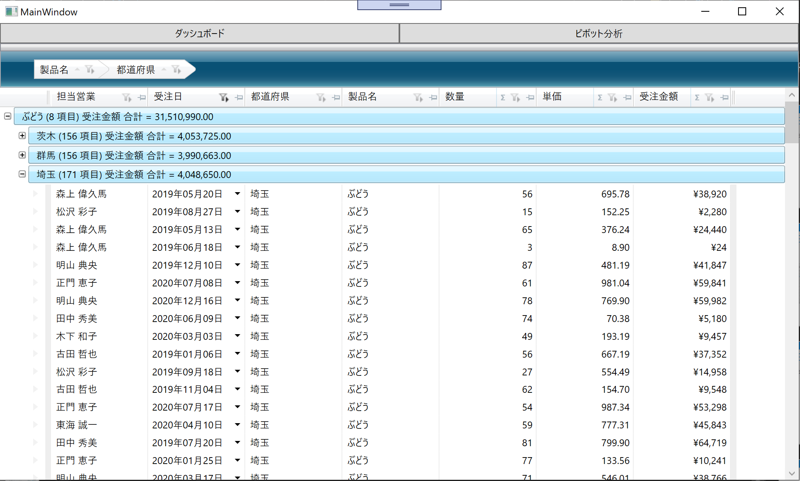

# Ignite UI for Angular hands-on workshop

## About this workshop

This workshop is for those who want to try Infragistics products in WPF application development or who are looking for rich and fast WPF UI controls, e.g. grid and chart. You can experience how to build WPF app with Infragistics WPF controls and Control Configulator and see its productivity through this workshop.

## Check your environment

Before starting this hands-on workshop please check your environment to see if it's ready.

[Required Environment](docs/00-Environment.md)

## Application for the workshop

Download the copy of this repository and find infragistics-wpf-workshop/src/before/IgWpfWorkshop which would be the start point of the workshop. This project has all Models and ViewModels required in the workshop but the views have empty so that you can focus on creating views with Infragistics products. Please open it with Visual Studio and build to see if it can work on your PC.

Note that there's After folder which contains the expected project when you completed all instructions, Section 1 to Section 3.

## All steps

1. [Section 1 - Get started with Infragistics grid control](docs/01-Use-Infragistics-Grid-control/01-00-Overview-of-Section1.md)
    1. [Get started with XamDataGrid](docs/01-Use-Infragistics-Grid-control/01-01-Get-started-with-XamDataGrid.md)
    2. [Configure XamDataGrid](docs/01-Use-Infragistics-Grid-control/01-02-Configure-XamDataGrid.md)
2. [Section 2 - Create a dashboard with-Control Configulator](docs/02-Create-dashboard-with-Control-Configulator/02-00-Overview-of-Section2.md)
    1. [Install Control Configulator](docs/02-Create-dashboard-with-Control-Configulator/02-01-Install-Control-Configulator.md)
    2. [Layout screen with XamTileManager](docs/02-Create-dashboard-with-Control-Configulator/02-02-Layout-screen-with-XamTileManager.md)
    3. [Configure PieChart](docs/02-Create-dashboard-with-Control-Configulator/02-03-Configure-PieChart.md)
    4. [Configure BulletGraph](docs/02-Create-dashboard-with-Control-Configulator/02-04-Configure-BulletGraph.md)
    5. [Configure Grid](docs/02-Create-dashboard-with-Control-Configulator/02-05-Configure-Grid.md)
    6. [Configure CategoryChart](docs/02-Create-dashboard-with-Control-Configulator/02-06-Configure-CategoryChart.md)
3. [Section 3 - Create Self-BI UI with Pivot controls](docs/03-Create-Self-BI-UI-with-Pivot-controls/03-00-Overview-of-Section3.md)
    1. [Use FlatDataSource](docs/03-Create-Self-BI-UI-with-Pivot-controls/03-01-Use-FlatDataSource.md)
    2. [Use Pivot Controls](docs/03-Create-Self-BI-UI-with-Pivot-controls/03-02-Use-Pivot-Controls.md)

## What you create through this workshop.
Section 1 - Get started with Infragistics grid control

Section 2 - Create a dashboard with-Control Configulator

Section 3 - Create Self-BI UI with Pivot controls
