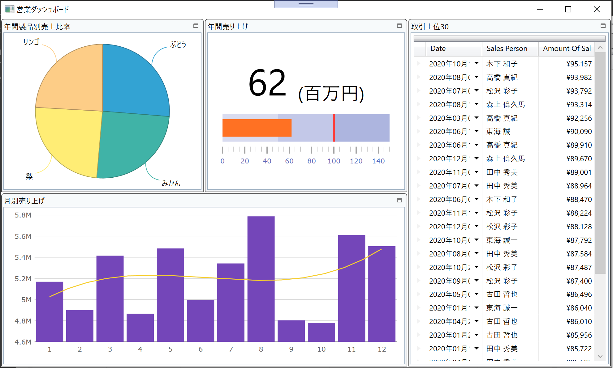

# Generate Angular project with igniteui-cli

In this section, you can learn how to Infragistics Control Configulator and eventually make a rich dashboard with some Infragistics WPF controls in Dashboard.xaml.

## Steps
1. [Install Control Configulator](02-01-Install-Control-Configulator.md)
2. [Layout screen with XamTileManager](02-02-Layout-screen-with-XamTileManager.md)
3. [Configure PieChart](02-03-Configure-PieChart.md)
4. [Configure BulletGraph](02-04-Configure-BulletGraph.md)
5. [Configure Grid](02-05-Configure-Grid.md)
6. [Configure CategoryChart](02-06-Configure-CategoryChart.md)

## What you build in this section

## Next
[02-01 Install Control Configulator](02-01-Install-Control-Configulator.md)