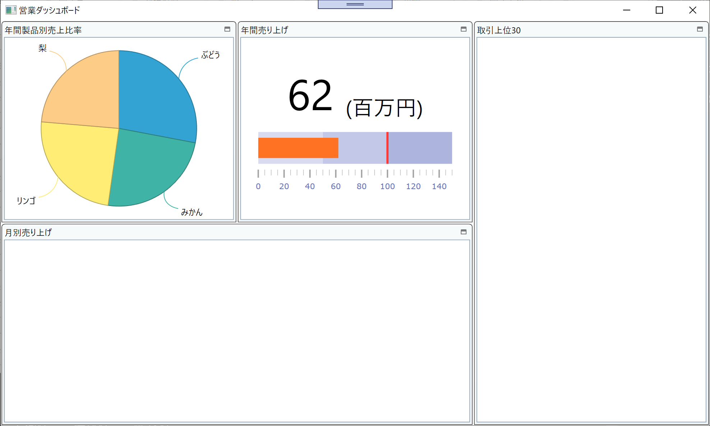

# Configure BulletGraph

You add a bullet graph here to express how the total sales this year goes on compared to the sales target. You use XamBulletGraph to achieve it and configure it by Infragistics Control Configulator.

## Check the datasource to be bound to XamBulletGraph.

Open DashboardViewModel.cs, set a breakpoint and start debugging to see what's in the bound data TotalSalesThisYear and SalesTargetThisYear. Each property should return interger value.

## Put XamBulletGraph

In Dashboard.xaml, put XamBulletGraph on the second tile and reset its layout. You would like to put not only a bullet graph but also a TextBlock above the graph to display the value with large size font. Put the TextBlock and the XamBulletGraph inside a StackPanel as below.

Dashboard.xaml

```xml
...
<ig:XamTile
    Header="Total Sales Amount in this year"
    ig:XamTileManager.Column="1"
    ig:XamTileManager.Row="0" 
    ig:XamTileManager.ColumnSpan="1"
    ig:XamTileManager.RowSpan="1">
    <StackPanel VerticalAlignment="Center" >
        <TextBlock/>
        <ig:XamBulletGraph/>
    </StackPanel>
</ig:XamTile>
...
```

## Configure XamBulletGraph with Control Configulator.

Click the line of the XamBulletGraph definition and then a light bulb should show up on the right side. Hit Ctrl + . or click the light bulb and select "Configure XamBulletGraph". The configulator would show up. In the configulator dialog, filter by "value" in the property window.


Bind TargetValue property to SalesTargetThisYear and Value property to TotalSalesThisYear.


Change Gauges Holizontal setting as below


Change the properties, Max, Value(which is just a test data), Target Value(which is just a test data), intercal as below. In Ranges pane, click clear button once and put 2 in the input then click create. It makes 3 ranges by calculating with Max value and the splitting count.


Configure XamBulletGraph if you would like to do more. When you completed click the button "Apply & Close".

## Bind TextBlock to the TotalSales.

Bind TextBlock to TotalSalesThisYear and configure its looks as below.

Dashboard.xaml

```xml
...
<TextBlock HorizontalAlignment="Center" TextWrapping="Wrap" FontSize="80" Text="{Binding Path=TotalSalesThisYear, StringFormat= $ {0} M }"/>
</ig:XamBulletGraph ...>
...
```

## Check the result

Run the app and check the result.



## Note
If you want to learn more about XamBulletGraph, check the help topic here.
[Adding Bullet Graph](https://www.infragistics.com/help/wpf/bulletgraph-adding)

## Next
[02-05 Configure Grid](02-05-Configure-Grid.md)
