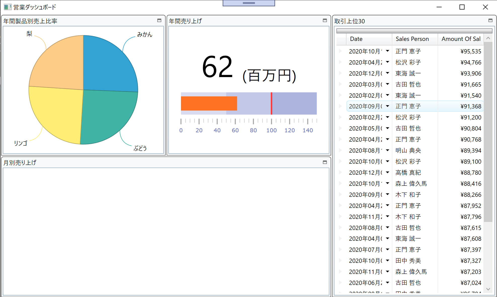

# Configure Grid

You add a grid here to dispaly top 30 large deals. You use XamDataGrid to achieve it and configure it by Infragistics Control Configulator.

## Check the datasource to be bound to XamDataGrid.

Open DashboardViewModel.cs, set a breakpoint and start debugging to see what's in the bound data Top30LargeDeals. That should be like below.

| AmountOfSale | City | Date | NumberOfUnits | ProductName | SalesPerson | UnitPrice |
----|----|----|----|----|----|----
123 | Singapore | 2018/01/01 | 123 | Banana | Lisa Andrews | 123
456 | New York | 2018/02/02 | 456 | Grape | William Fox | 456
... | ... | ... | ... | ... | ... | ...

Note that the data is already ordered by AmountOfSale and extracted the top 30 recoreds.

## Put XamDataGrid

In Dashboard.xaml, put XamDataGrid on the 3rd tile and reset its layout.

Dashboard.xaml

```xml
...
<ig:XamTile
    Header="Top 30 large deals in this year"
    ig:XamTileManager.Column="2"
    ig:XamTileManager.Row="0" 
    ig:XamTileManager.ColumnSpan="1"
    ig:XamTileManager.RowSpan="2">
    <Custom:XamDataGrid/>
</ig:XamTile>
...
```

## Configure XamDataGrid with Control Configulator.

Click the line of the XamDataGrid definition and then a light bulb should show up on the left side. Hit Ctrl + . or click the light bulb and select "Configure XamDataGrid". In the configure dialog find DataSource property in the property window and Select "Create Data Binding".


In the data Select Top30LargeDeals and click the button "Create Binding".


Select "Sale Layout" in XamDataGrid Objects window then properties in Sale model appear in Fields-Available window. Add fields you like to display by clicking "+" icon.


If you have AmountOfSale in the fields definition, turn it to CurrencyField so that it gets automatically formatted. 


Note that you can set your format by changing the format property.


If you would like to make all fields auto-adjustable to the grid width, set the autoFit property to True.


Configure XamDataGrid as you like with other properties and then click the button "Apply & Close" when you completed.


## Check the result

Run the app and check the result.



## Note
If you want to learn more about XamDataGrid, check the help topic.

[Using the Control Configurator with XamDataGrid](https://www.infragistics.com/help/wpf/using-control-configurator-with-data-grid)

[Adding xamDataGrid to Your Page](https://www.infragistics.com/help/wpf/xamdatagrid-getting-started-with-xamdatagrid)

## Next
[02-06 Configure CategoryChart](02-06-Configure-CategoryChart.md)
