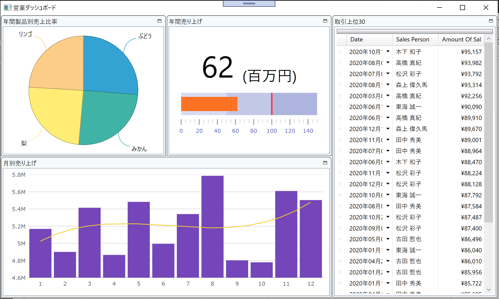

# Configure CategoryChart

You add a chart here to express monthly sales trend. You use CategoryChart to achieve it and configure it by Infragistics Control Configulator.

## Check the datasource to be bound to XamCategoryChart.

Open DashboardViewModel.cs, set a breakpoint and start debugging to see what's in the bound data MonthlySalesAmount. That should be like below.

| Month | AmountOfSale |
----|---- 
| 1 | 123 |
| 2 | 456 |
| ... | ... |


## Put XamCategoryChart

In Dashboard.xaml, put XamCategoryChart on the 4th tile and reset its layout.

Dashboard.xaml

```xml
...
<ig:XamTile
    Header="Monthly Sales Amount in this year"
    ig:XamTileManager.Column="0"
    ig:XamTileManager.Row="1" 
    ig:XamTileManager.ColumnSpan="2"
    ig:XamTileManager.RowSpan="1" >
    <ig:XamCategoryChart />
</ig:XamTile>
...
```

## Configure XamCategoryChart with Control Configulator.

Click the line of the XamCategoryChart definition and then a light bulb should show up on the left side. Hit Ctrl + . or click the light bulb and select "Configure XamCategoryChart". In the configure dialog find ItemsSource property in the property window and Select "Create Data Binding".


In the dialog, select MonthlySalesAmount and click the button "Create Binding".


Change the chart type to the default for displaying normal column chart (bar chart).


To display a trend line, set TrendLineType to CubicFit.


Set XAxisInterval property to 1 so all months can have own label, 1 to 12.


Configure with other properties and click the button "Apply & Close" when you completed.


## Check the result

Run the app and check the result.



## Note
XamCategoryChart is a hi-performance chart which is simple and easy to use, but you can't develop very complex chart, e.g. overlaying multiple charts and having multiple axes. If you want to implement such complex chart UI then you can use XamDataChart insted.

[Getting Started with XamCategoryChart](https://www.infragistics.com/help/wpf/categorychart-walkthrough)

[Getting Started with XamDataChart](https://www.infragistics.com/help/wpf/datachart-getting-started-with-datachart)

## Next
[Overview of Section3](../03-Create-Self-BI-UI-with-Pivot-controls/03-00-Overview-of-Section3.md)
